# **Цель работы:**

Изучить идеологию и применение средств контроля версий.

# **Задача:**

Настроить репозиторий на GitHub и научиться работать с ним.

# **Выполнение лабораторной работы:**

## Настройка git.

1. Создадим учетную запись на https://github.org (Рис.1):

2. Настраиваем систему контроля версий git:
    1. С помощью команды **ssh-keygen -C "Бабков Дмитрий 1032201726@pfur.ru"** генерируем **ssh ключ** (Рис.2)  
    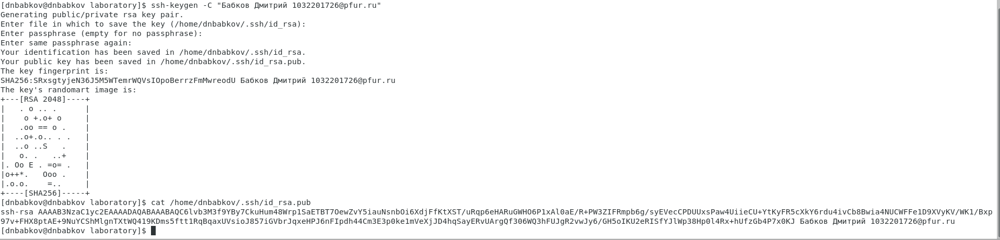
    2. Добавляем этот ключ в свойствах github (Рис.3)  
    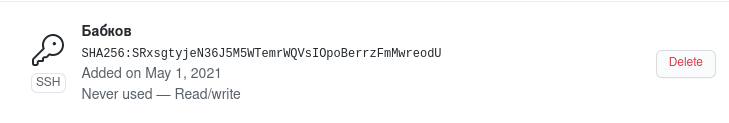
3. При помощи команды **mkdir -p /home/work/2020-2021/OperatingSystems/laboratory** создаем структуру каталога для лабораторных работ (Рис.4).
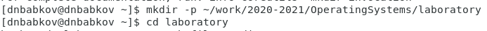

## Подключение репозитория к Github

- Создам рипозиторий на Github и назову его **intro-os** (Рис.5)  
  

- С помощью команды **git init** инициализирую системы git (Рис.6)  
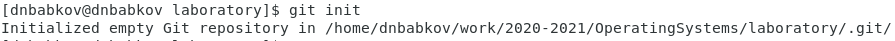  

- Создаем заготовку для файла **README.md** с помощью команд **echo "# Лабораторные работы" >> README.md** и **git add README.md** (Рис.7)  
  

- Делаем первый коммит и загружаем его на Github (Рис.8,9)  
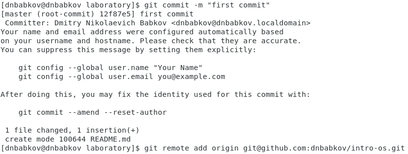  
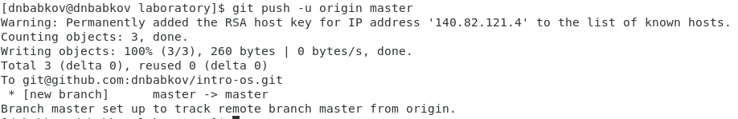  

## Первичная конфигурация

- Добавим файл лицензии (Рис.10)  
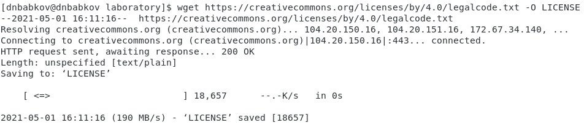  

- Также с помощью команды **Curl -L -s https://www.gitignore.io/api/c >> .gitignore** добавляем шаблон игнорируемых файлов для С  

- С помощью **git add .** добавляем новые файлы (Рис11), делаем коммит командой **git commit -a** (Рис.12, 13) и отправляем на Гитхаб  командой **git push** (Рис. 14)  
  
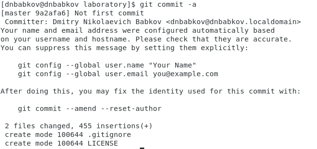  
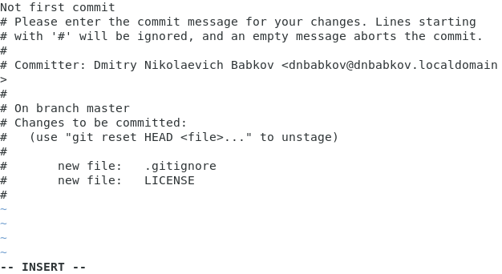  
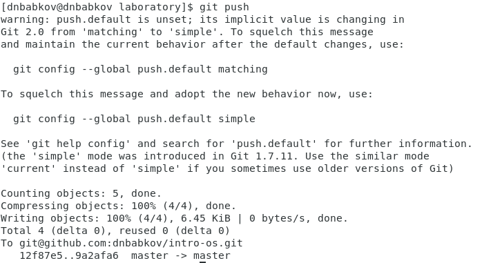  

## Конфигурация git-flow

- Устанавливaем git-flow для CentOS (Рис.15, 16)  
  
  

- Инициализируем git-flow командой **git flow init**, префикс устанавливаем v (Рис.17)  
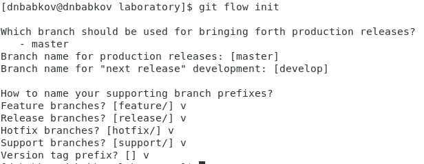  

- Командой **git branch** проверяем, что мы находимся на ветке **develop** (Рис.18)  
  

- Командой **git flow release start 1.0.0** создаем релиз с версией 1.0.0 (Рис.19) и запишем версию (Рис.20)  
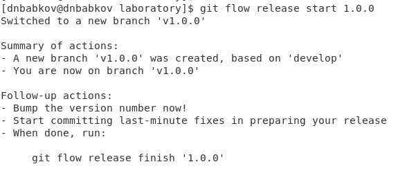  
  

- Добавим в индекс командами **git add .** и  **git commit -am 'chore(main): add version'** (Рис.21)  
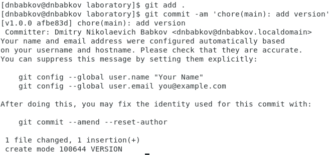  

- Залью релизную ветку в основную командой **git flow release finish 1.0.0** (Рис. 22)
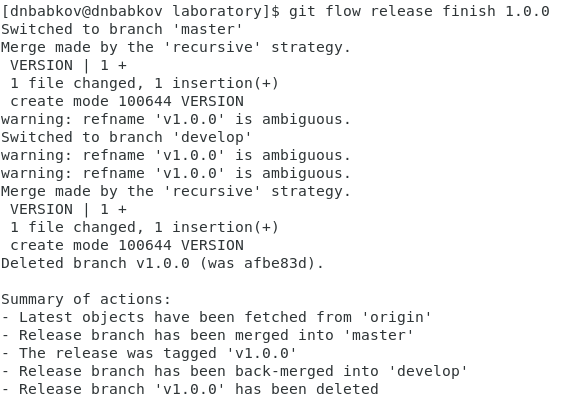  

- И последним пунктом мы отправим данные на github командами **git push --all** и **git push --tags** (Рис.23, 24)
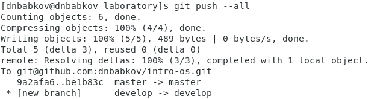  
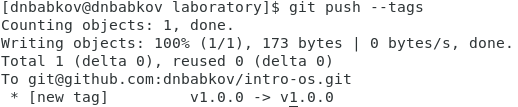  

# **Выводы:**

Я изучил идеологию и применение средств контроля версий git и научился их использовать.

# **Контрольные вопросы:**

