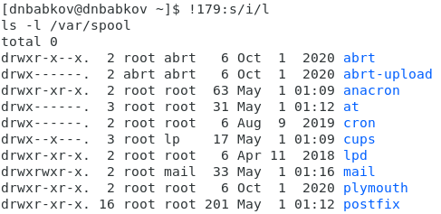

---
# Front matter
lang: ru-RU
title: "Лабораторная работа №5"
author: "Бабков Дмитрий Николаевич, НПМбд-01-20"

# Formatting
toc-title: "Содержание"
toc: true # Table of contents
toc_depth: 2
lof: true # List of figures
lot: true # List of tables
fontsize: 12pt
linestretch: 1.5
papersize: a4paper
documentclass: scrreprt
polyglossia-lang: russian
polyglossia-otherlangs: english
mainfont: PT Serif
romanfont: PT Serif
sansfont: PT Sans
monofont: PT Mono
mainfontoptions: Ligatures=TeX
romanfontoptions: Ligatures=TeX
sansfontoptions: Ligatures=TeX,Scale=MatchLowercase
monofontoptions: Scale=MatchLowercase
indent: true
pdf-engine: lualatex
header-includes:
  - \linepenalty=10 # the penalty added to the badness of each line within a paragraph (no associated penalty node) Increasing the value makes tex try to have fewer lines in the paragraph.
  - \interlinepenalty=0 # value of the penalty (node) added after each line of a paragraph.
  - \hyphenpenalty=50 # the penalty for line breaking at an automatically inserted hyphen
  - \exhyphenpenalty=50 # the penalty for line breaking at an explicit hyphen
  - \binoppenalty=700 # the penalty for breaking a line at a binary operator
  - \relpenalty=500 # the penalty for breaking a line at a relation
  - \clubpenalty=150 # extra penalty for breaking after first line of a paragraph
  - \widowpenalty=150 # extra penalty for breaking before last line of a paragraph
  - \displaywidowpenalty=50 # extra penalty for breaking before last line before a display math
  - \brokenpenalty=100 # extra penalty for page breaking after a hyphenated line
  - \predisplaypenalty=10000 # penalty for breaking before a display
  - \postdisplaypenalty=0 # penalty for breaking after a display
  - \floatingpenalty = 20000 # penalty for splitting an insertion (can only be split footnote in standard LaTeX)
  - \raggedbottom # or \flushbottom
  - \usepackage{float} # keep figures where there are in the text
  - \floatplacement{figure}{H} # keep figures where there are in the text
---

# Цель работы

Приобретение практических навыков взаимодействия пользователя с системой
посредством командной строки.

# Задание

Научиться пользоваться командной строкой

# Ход работы

1. С помощью команды **pwd** выводим на экран полное имя домашнего каталога (Рис.1)  
  
2. Выполним следующие действия:  
    2.1. Перейдем в каталог **/tmp** и выведем на экран его содержимое с помощью команды **ls** (Рис.2)  
      
    Выведем это же содержимое, только на этот раз с опцией **-i** (Рис.3)  
      
    Отличие в выводе заключается в том, что в первом случае выводится все содержимое в алфавитном порядке, а во втором оно выводятся в алфавитном порядке с индесами.  
    2.2. Определим, есть ли в каталоге **/var/spool** подкаталог с именем **cron** (Рис.4)  
      
    2.3. Перейдем обратно в домашний каталог и выведем его содержимое командой **ls -l**. Определим владельца файлов и подкаталогов (Рис.5)  
      
    Можно увидеть, что владельцем файлов и подкаталогов является **dnbabkov**  
3. Выполним следующие действия:  
    3.1. В домашнем каталоге создадим новый каталог с именем **newdir** и в нем создадим еще один каталог **morefun** (Рис.6)  
      
    3.2. В домашнем каталоге создадим три новых каталога одной командой, а потом одний командой их и удалим (Рис.7, 8)  
      
      
    3.3. Пробуем удалить каталог **~/newdir** командой **rm** и проверяем, удалось ли(Рис.9)  
      
    Как можно увидеть, удаление удалось  
4. С помощью команды **man** определяю, какую опцию команды **ls** нужно исполь-
зовать для просмотра содержимого не только указанного каталога, но и подката-
логов, входящих в него. (Рис.10, 11)  
  
  
5. С помощью команды **man** определяю набор опций команды **ls**, позволяющий от-
сортировать по времени последнего изменения выводимый список содержимого
каталога с развёрнутым описанием файлов. (Рис.12, 13)  
  
  
6. Использую команду **man** для просмотра описания следующих команд: cd, pwd,
mkdir, rmdir, rm. Из описания понятно, что **cd** используется для того, чтобы сменить текущую директорию, **pwd** - для того, чтобы узнать полное имя текущего каталога, **mkdir** - для создания директорий, **rmdir** - для удаления, а **rm** - для удаления файлов или каталогов.  
7. Используя информацию, полученную при помощи команды history, выполняю
модификацию и исполнение нескольких команд из буфера команд. (Рис.14, 15)  
  
  

# Вывод:
Я приобрел практические навыки взаимодействия с системой при помощи командной строки.

# Контрольные вопросы

1) Командная строка – специальная программа, позволяющая управлять
операционной системой при помощи текстовых команд, вводимых в
окне приложения.
2) Для определения абсолютного пути к текущему каталогу используется
команда pwd (print working directory). Например, команда «pwd» в
моем домашнем каталоге выведет: /home/kaleontjeva
3) Команда «ls -F» (или «ls -aF», тогда появятся еще скрытые файлы)
выведет имена файлов в текущем каталоге и их типы.
Тип каталога обозначается /, тип исполняемого файла обозначается *,
тип ссылки обозначается @.
4) Имена скрытых файлов начинаются с точки. Эти файлы в
операционной системе скрыты от просмотра и обычно используются
для настройки рабочей среды. Для того, чтобы отобразить имена
скрытых файлов, необходимо использовать команду «ls –a». 
5) Команда rm используется для удаления файлов и/или каталогов.
Команда rm -i выдает запрос подтверждения на удаление файла.
Команда rm -r необходима, чтобы удалить каталог, содержащий файлы.
Без указания этой опции команда не будет выполняться. Если каталог
пуст, то можно воспользоваться командой rmdir. Если удаляемый
каталог содержит файлы, то команда не будет выполнена – нужно
использовать «rm -r имя_каталога».
Таким образом, каталог, не содержащий файлов, можно удалить и
командой rm, и командой rmdir. Файл командой rmdir удалить нельзя.
6) Чтобы определить, какие команды выполнил пользователь в сеансе
работы, необходимо воспользоваться командой «history».
7) Чтобы исправить или запустить на выполнение команду, которую
пользователь уже использовал в сеансе работы, необходимо: в первом
случае: воспользоваться конструкцией
!<номер_команды>:s/<что_меняем>/<на_что_меняем>, во втором
случае: !<номер_команды>. 
8) Чтобы записать в одной строке несколько команд, необходимо между
ними поставить ; . Например, «cd /tmp; ls».
9) Символ обратного слэша \ позволяет использовать управляющие
символы ( ".", "/", "$", "*", "[", "]", "^", "&") без их интерпретации
командной оболочкой; процедура добавления данного символа перед
управляющими символами называется экранированием символов.
Например, команда «ls newdir\/morefun» отобразит содержимое
каталога newdir/morefun.
10) Команда «ls -l» отображает список каталогов и файлов с подробной
информацией о них (тип файла, право доступа, число ссылок,
владелец, размер, дата последней ревизии, имя файла или каталога).
11) Полный, абсолютный путь от корня файловой системы – этот путь
начинается от корня "/" и описывает весь путь к файлу или каталогу;
Относительный путь – это путь к файлу относительно текущего
каталога (каталога, где находится пользователь). Например, «cd
/newdir/morefun» – абсолютный путь, «cd newdir» – относительный
путь.
12) Чтобы получить необходимую информацию о команде, необходимо
воспользоваться конструкцией man [имя_команды], либо использовать
опцию help, которая предусмотрена для некоторых команд.
13) Для автоматического дополнения вводимых команд служит клавиша
Tab.
